# MainQuest 07 : U-Net 성능 개선 프로젝트


```python
# 필요 라이브러리 로딩
from __future__ import absolute_import, division
from __future__ import print_function, unicode_literals

import os
import time
import shutil
import functools

import tensorflow
import sklearn
import numpy

import numpy as np
import matplotlib.pyplot as plt
%matplotlib inline
import matplotlib as mpl
mpl.rcParams['axes.grid'] = False
mpl.rcParams['figure.figsize'] = (12,12)

from sklearn.model_selection import train_test_split
from sklearn.metrics import confusion_matrix
import matplotlib.image as mpimg
import pandas as pd
from PIL import Image
from IPython.display import clear_output

import tensorflow as tf
import tensorflow_addons as tfa
print(tf.__version__)

from tensorflow.keras import layers
from tensorflow.keras import losses
from tensorflow.keras import models
```

    2.6.0


```python
DATASET_PATH = os.path.join(os.getenv('HOME'), 'aiffel', 'medical')

img_dir = os.path.join(DATASET_PATH, "train")
label_dir = os.path.join(DATASET_PATH, "train_labels")
```


```python
x_train_filenames = [os.path.join(img_dir, filename) for filename in os.listdir(img_dir)]
x_train_filenames.sort()
y_train_filenames = [os.path.join(label_dir, filename) for filename in os.listdir(label_dir)]
y_train_filenames.sort()
```


```python
x_train_filenames, x_test_filenames, y_train_filenames, y_test_filenames = \
                    train_test_split(x_train_filenames, y_train_filenames, test_size=0.2)
```


```python
num_train_examples = len(x_train_filenames)
num_test_examples = len(x_test_filenames)

print("Number of training examples: {}".format(num_train_examples))
print("Number of test examples: {}".format(num_test_examples))
```

    Number of training examples: 240
    Number of test examples: 60


### Visualization


```python
display_num = 5

r_choices = np.random.choice(num_train_examples, display_num)

plt.figure(figsize=(10, 15))
for i in range(0, display_num * 2, 2):
    img_num = r_choices[i // 2]
    x_pathname = x_train_filenames[img_num]
    y_pathname = y_train_filenames[img_num]

    plt.subplot(display_num, 2, i + 1)
    plt.imshow(Image.open(x_pathname))
    plt.title("Original Image")

    example_labels = Image.open(y_pathname)
    label_vals = np.unique(example_labels)

    plt.subplot(display_num, 2, i + 2)
    plt.imshow(example_labels)
    plt.title("Masked Image")
    
plt.suptitle("Examples of Images and their Masks")
plt.show()
```


    
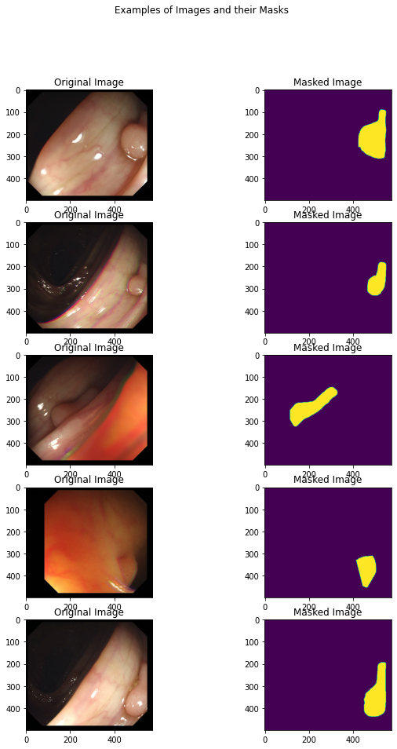
    


### Set up hyper-parameters


```python
# Set hyperparameters

image_size = 256
img_shape = (image_size, image_size, 3)
batch_size = 8
max_epochs = 20
```

## **Data pipeline and Preprocessing**

Processing each pathname  


```python
def _process_pathnames(fname, label_path):
    # We map this function onto each pathname pair
    img_str = tf.io.read_file(fname)
    img = tf.image.decode_bmp(img_str, channels=3)

    label_img_str = tf.io.read_file(label_path)
    label_img = tf.image.decode_bmp(label_img_str, channels=3)
    label_img = tf.image.rgb_to_grayscale(label_img)

    resize = [image_size, image_size]
    img = tf.image.resize(img, resize)
    label_img = tf.image.resize(label_img, resize)

    scale = 1 / 255.
    img = tf.cast(img, dtype=tf.float32) * scale
    label_img = tf.cast(label_img, dtype=tf.float32) * scale

    return img, label_img
```

Data augmentation - Shifting the image  


```python
def shift_img(output_img, label_img, width_shift_range, height_shift_range):
    """This fn will perform the horizontal or vertical shift"""
    if width_shift_range or height_shift_range:
        if width_shift_range:
                width_shift_range = tf.random.uniform([],
                                                  -width_shift_range * img_shape[1],
                                                  width_shift_range * img_shape[1])
        if height_shift_range:
                height_shift_range = tf.random.uniform([],
                                                   -height_shift_range * img_shape[0],
                                                   height_shift_range * img_shape[0])
        output_img = tfa.image.translate(output_img,
                                         [width_shift_range, height_shift_range])
        label_img = tfa.image.translate(label_img,
                                        [width_shift_range, height_shift_range])
    return output_img, label_img
```

Data augmentation - Flipping the image randomly  


```python
def flip_img(horizontal_flip, tr_img, label_img):
    if horizontal_flip:
        flip_prob = tf.random.uniform([], 0.0, 1.0)
        tr_img, label_img = tf.cond(tf.less(flip_prob, 0.5),
                                lambda: (tf.image.flip_left_right(tr_img), tf.image.flip_left_right(label_img)),
                                lambda: (tr_img, label_img))
    return tr_img, label_img
```

Data augmentation Assembling  


```python
def _augment(img,
             label_img,
             resize=None,  # Resize the image to some size e.g. [256, 256]
             scale=1,  # Scale image e.g. 1 / 255.
             hue_delta=0.,  # Adjust the hue of an RGB image by random factor
             horizontal_flip=True,  # Random left right flip,
             width_shift_range=0.05,  # Randomly translate the image horizontally
             height_shift_range=0.05):  # Randomly translate the image vertically 
    if resize is not None:
        # Resize both images
        label_img = tf.image.resize(label_img, resize)
        img = tf.image.resize(img, resize)
  
    if hue_delta:
        img = tf.image.random_hue(img, hue_delta)
  
    img, label_img = flip_img(horizontal_flip, img, label_img)
    img, label_img = shift_img(img, label_img, width_shift_range, height_shift_range)
    label_img = tf.cast(label_img, dtype=tf.float32) * scale
    img = tf.cast(img, dtype=tf.float32) * scale
    return img, label_img
```

### Set up train and test datasets


```python
def get_baseline_dataset(filenames,
                         labels,
                         preproc_fn=functools.partial(_augment),
                         threads=4,
                         batch_size=batch_size,
                         is_train=True):
    num_x = len(filenames)
    # Create a dataset from the filenames and labels
    dataset = tf.data.Dataset.from_tensor_slices((filenames, labels))
    # Map our preprocessing function to every element in our dataset, taking
    # advantage of multithreading
    dataset = dataset.map(_process_pathnames, num_parallel_calls=threads)

    if is_train:# 학습을 진행할시에만 위에 augment를 진행합니다.
        #if preproc_fn.keywords is not None and 'resize' not in preproc_fn.keywords:
        #  assert batch_size == 1, "Batching images must be of the same size"
        dataset = dataset.map(preproc_fn, num_parallel_calls=threads)
        dataset = dataset.shuffle(num_x * 10)

    dataset = dataset.batch(batch_size)
    return dataset
```


```python
train_dataset = get_baseline_dataset(x_train_filenames, # 학습 데이터
                                     y_train_filenames) # 정답 데이터
train_dataset = train_dataset.repeat()
test_dataset = get_baseline_dataset(x_test_filenames,
                                    y_test_filenames,
                                    is_train=False)
train_dataset
```


    <RepeatDataset shapes: ((None, 256, 256, 3), (None, 256, 256, 1)), types: (tf.float32, tf.float32)>


### Plot some train data


```python
for images, labels in train_dataset.take(1):
    # Running next element in our graph will produce a batch of images
    plt.figure(figsize=(10, 10))
    img = images[0]

    plt.subplot(1, 2, 1)
    plt.imshow(img)

    plt.subplot(1, 2, 2)
    plt.imshow(labels[0, :, :, 0])
    plt.show()
```


    
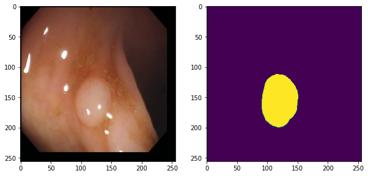
    


## **Build the three model**
### **ED vs Unet vs Pretrained_Unet**

### **1. Encoder-Decoder architecture**


Encoder


```python
# inputs: [batch_size, 256, 256, 3]
encoder = tf.keras.Sequential(name='encoder')

# conv-batchnorm-activation-maxpool
encoder.add(layers.Conv2D(64, (3, 3), padding='same'))
encoder.add(layers.BatchNormalization())
encoder.add(layers.Activation('relu'))
encoder.add(layers.Conv2D(64, (3, 3), strides=2, padding='same'))
encoder.add(layers.BatchNormalization())
encoder.add(layers.Activation('relu')) # conv1: [batch_size, 128, 128, 64]

encoder.add(layers.Conv2D(128, (3, 3), padding='same'))
encoder.add(layers.BatchNormalization())
encoder.add(layers.Activation('relu'))
encoder.add(layers.Conv2D(128, (3, 3), strides=2, padding='same'))
encoder.add(layers.BatchNormalization())
encoder.add(layers.Activation('relu')) # conv2: [batch_size, 64, 64, 128]

encoder.add(layers.Conv2D(256, (3, 3), padding='same'))
encoder.add(layers.BatchNormalization())
encoder.add(layers.Activation('relu'))
encoder.add(layers.Conv2D(256, (3, 3), strides=2, padding='same'))
encoder.add(layers.BatchNormalization())
encoder.add(layers.Activation('relu')) # conv3: [batch_size, 32, 32, 256]

encoder.add(layers.Conv2D(512, (3, 3), padding='same'))
encoder.add(layers.BatchNormalization())
encoder.add(layers.Activation('relu'))
encoder.add(layers.Conv2D(512, (3, 3), strides=2, padding='same'))
encoder.add(layers.BatchNormalization())
encoder.add(layers.Activation('relu')) # conv4-outputs: [batch_size, 16, 16, 512]
```


```python
# Encoder 제대로 만들어졌는지 확인

bottleneck = encoder(tf.random.normal([batch_size, 256, 256, 3]))
print(bottleneck.shape)   # (batch_size, 16, 16, 512) 이 나오는지 확인
```

    (8, 16, 16, 512)


Decoder


```python
# inputs: [batch_size, 16, 16, 512]
decoder = tf.keras.Sequential(name='decoder')

# conv_transpose-batchnorm-activation
decoder.add(layers.Conv2DTranspose(256, (3, 3), strides=2, padding='same'))
decoder.add(layers.BatchNormalization())
decoder.add(layers.Activation('relu')) # conv_transpose1: [batch_size, 32, 32, 256]
decoder.add(layers.Conv2D(256, (3, 3), padding='same'))
decoder.add(layers.BatchNormalization())
decoder.add(layers.Activation('relu'))

decoder.add(layers.Conv2DTranspose(128, (3, 3), strides=2, padding='same'))
decoder.add(layers.BatchNormalization())
decoder.add(layers.Activation('relu')) # conv_transpose2: [batch_size, 64, 64, 128]
decoder.add(layers.Conv2D(128, (3, 3), padding='same'))
decoder.add(layers.BatchNormalization())
decoder.add(layers.Activation('relu'))

decoder.add(layers.Conv2DTranspose(64, (3, 3), strides=2, padding='same'))
decoder.add(layers.BatchNormalization())
decoder.add(layers.Activation('relu')) # conv_transpose3: [batch_size, 128, 128, 64]
decoder.add(layers.Conv2D(64, (3, 3), padding='same'))
decoder.add(layers.BatchNormalization())
decoder.add(layers.Activation('relu'))

decoder.add(layers.Conv2DTranspose(32, (3, 3), strides=2, padding='same'))
decoder.add(layers.BatchNormalization())
decoder.add(layers.Activation('relu')) # conv transpose4-outputs: [batch_size, 256, 256, 32]
decoder.add(layers.Conv2D(32, (3, 3), padding='same'))
decoder.add(layers.BatchNormalization())
decoder.add(layers.Activation('relu'))

decoder.add(layers.Conv2DTranspose(1, 1, strides=1, padding='same', activation='sigmoid'))
```


```python
# decoder 제대로 만들어졌는지 확인

predictions = decoder(bottleneck)
print(predictions.shape)    # (batch_size, 256, 256, 1) 이 나오는지 확인
```

    (8, 256, 256, 1)


### Create a encoder-decoder model


```python
ed_model = tf.keras.Sequential()

ed_model.add(encoder)
ed_model.add(decoder)
```

### **2. U-Net architecture**


```python
class Conv(tf.keras.Model):
    def __init__(self, num_filters, kernel_size):
        super(Conv, self).__init__()
        self.conv = layers.Conv2D(num_filters, kernel_size, padding='same')
        self.bn = layers.BatchNormalization()

    def call(self, inputs, training=True):
        x = self.conv(inputs)
        x = self.bn(x, training=training)
        x = layers.ReLU()(x)

        return x
```


```python
class ConvBlock(tf.keras.Model):
    def __init__(self, num_filters):
        super(ConvBlock, self).__init__()
        self.conv1 = Conv(num_filters, 3)
        self.conv2 = Conv(num_filters * 2, 3)

    def call(self, inputs, training=True):
        encoder = self.conv1(inputs, training=training)
        encoder = self.conv2(encoder, training=training)

        return encoder

class ConvBlock_R(tf.keras.Model):
    def __init__(self, num_filters):
        super(ConvBlock_R, self).__init__()
        self.conv1 = Conv(num_filters, 3)
        self.conv2 = Conv(num_filters, 3)

    def call(self, inputs, training=True):
        decoder = self.conv1(inputs, training=training)
        decoder = self.conv2(decoder, training=training)

        return decoder


class EncoderBlock(tf.keras.Model):
    def __init__(self, num_filters):
        super(EncoderBlock, self).__init__()
        self.conv_block = ConvBlock(num_filters)
        self.encoder_pool = layers.MaxPool2D()

    def call(self, inputs, training=True):
        encoder = self.conv_block(inputs, training=training)
        encoder_pool = self.encoder_pool(encoder)

        return encoder_pool, encoder


class DecoderBlock(tf.keras.Model):
    def __init__(self, num_filters):
        super(DecoderBlock, self).__init__()
        self.convT = layers.Conv2DTranspose(num_filters, 3, strides=2, padding='same')
        self.bn = layers.BatchNormalization()
        self.conv_block_r = ConvBlock_R(num_filters)

    def call(self, input_tensor, concat_tensor, training=True):
        decoder = self.convT(input_tensor)            
        decoder = self.bn(decoder, training=training)
        decoder = layers.ReLU()(decoder)
        decoder = tf.concat([decoder, concat_tensor], axis=-1)
        decoder = self.conv_block_r(decoder, training=training)

        return decoder
```


```python
class UNet(tf.keras.Model):
    def __init__(self):
        super(UNet, self).__init__()
        self.encoder_block1 = EncoderBlock(64)
        self.encoder_block2 = EncoderBlock(128)
        self.encoder_block3 = EncoderBlock(256)
        self.encoder_block4 = EncoderBlock(512)

        self.center = ConvBlock(1024)

        self.decoder_block4 = DecoderBlock(512)
        self.decoder_block3 = DecoderBlock(256)
        self.decoder_block2 = DecoderBlock(128)
        self.decoder_block1 = DecoderBlock(64)

        self.output_conv = layers.Conv2D(1, 1, activation='sigmoid')

    def call(self, inputs, training=True):
        encoder1_pool, encoder1 = self.encoder_block1(inputs)
        encoder2_pool, encoder2 = self.encoder_block2(encoder1_pool)
        encoder3_pool, encoder3 = self.encoder_block3(encoder2_pool)
        encoder4_pool, encoder4 = self.encoder_block4(encoder3_pool)

        center = self.center(encoder4_pool)

        decoder4 = self.decoder_block4(center, encoder4)
        decoder3 = self.decoder_block3(decoder4, encoder3)
        decoder2 = self.decoder_block2(decoder3, encoder2)
        decoder1 = self.decoder_block1(decoder2, encoder1)

        outputs = self.output_conv(decoder1)

        return outputs
```

### Create a U-Net model


```python
unet_model = UNet()
```

## **3. Pretrained U-Net model**


```python
class Vgg16UNet(tf.keras.Model):
    def __init__(self):
        super(Vgg16UNet, self).__init__()
        self.vgg16 = tf.keras.applications.VGG16(input_shape=img_shape,
                                         include_top=False,
                                         weights='imagenet')
        layer_outputs = [layer.output for layer in self.vgg16.layers]
        self.vgg16_act = models.Model(inputs=self.vgg16.input, 
                                      outputs=[layer_outputs[2], 
                                               layer_outputs[5], 
                                               layer_outputs[9], 
                                               layer_outputs[13], 
                                               layer_outputs[17]])


        self.center = ConvBlock(1024)

        self.decoder_block4 = DecoderBlock(512)
        self.decoder_block3 = DecoderBlock(256)
        self.decoder_block2 = DecoderBlock(128)
        self.decoder_block1 = DecoderBlock(64)

        self.output_conv = layers.Conv2D(1, 1, activation='sigmoid')

    def call(self, inputs, training=True):

        encoder1, encoder2, encoder3, encoder4, center = self.vgg16_act(inputs) 

        decoder4 = self.decoder_block4(center, encoder4)
        decoder3 = self.decoder_block3(decoder4, encoder3)
        decoder2 = self.decoder_block2(decoder3, encoder2)
        decoder1 = self.decoder_block1(decoder2, encoder1)
        
        outputs = self.output_conv(decoder1)

        return outputs
```

### Create a pretrained_unet model


```python
pretrained_unet = Vgg16UNet()
```

    Downloading data from https://storage.googleapis.com/tensorflow/keras-applications/vgg16/vgg16_weights_tf_dim_ordering_tf_kernels_notop.h5
    58892288/58889256 [==============================] - 0s 0us/step
    58900480/58889256 [==============================] - 0s 0us/step


### **Model Sumamry**


```python
# 모델 빌드를 위한 더미 입력 생성
dummy_input = tf.random.normal([1, image_size, image_size, 3])

# ED 모델 빌드 및 요약
print("\n=== ED Model Summary ===")
ed_model(dummy_input)  # 모델 빌드
ed_model.summary()

# U-Net 모델 빌드 및 요약
print("\n=== U-Net Model Summary ===")
unet_model(dummy_input)  # 모델 빌드
unet_model.summary()

# Pretrained U-Net 모델 빌드 및 요약
print("\n=== Pretrained U-Net Model Summary ===")
pretrained_unet(dummy_input)  # 모델 빌드
pretrained_unet.summary()
```

    
    === ED Model Summary ===
    Model: "sequential"
    _________________________________________________________________
    Layer (type)                 Output Shape              Param #   
    =================================================================
    encoder (Sequential)         (None, 16, 16, 512)       4693056   
    _________________________________________________________________
    decoder (Sequential)         (None, 256, 256, 1)       2354913   
    =================================================================
    Total params: 7,047,969
    Trainable params: 7,042,209
    Non-trainable params: 5,760
    _________________________________________________________________
    
    === U-Net Model Summary ===
    Model: "u_net"
    _________________________________________________________________
    Layer (type)                 Output Shape              Param #   
    =================================================================
    encoder_block (EncoderBlock) multiple                  76416     
    _________________________________________________________________
    encoder_block_1 (EncoderBloc multiple                  444288    
    _________________________________________________________________
    encoder_block_2 (EncoderBloc multiple                  1773312   
    _________________________________________________________________
    encoder_block_3 (EncoderBloc multiple                  7085568   
    _________________________________________________________________
    conv_block_4 (ConvBlock)     multiple                  28326912  
    _________________________________________________________________
    decoder_block (DecoderBlock) multiple                  18882048  
    _________________________________________________________________
    decoder_block_1 (DecoderBloc multiple                  3542784   
    _________________________________________________________________
    decoder_block_2 (DecoderBloc multiple                  886656    
    _________________________________________________________________
    decoder_block_3 (DecoderBloc multiple                  222144    
    _________________________________________________________________
    conv2d_30 (Conv2D)           multiple                  65        
    =================================================================
    Total params: 61,240,193
    Trainable params: 61,222,529
    Non-trainable params: 17,664
    _________________________________________________________________
    
    === Pretrained U-Net Model Summary ===
    Model: "vgg16u_net"
    _________________________________________________________________
    Layer (type)                 Output Shape              Param #   
    =================================================================
    vgg16 (Functional)           (None, 8, 8, 512)         14714688  
    _________________________________________________________________
    model (Functional)           [(None, 256, 256, 64), (N 14714688  
    _________________________________________________________________
    conv_block_5 (ConvBlock)     multiple                  0 (unused)
    _________________________________________________________________
    decoder_block_4 (DecoderBloc multiple                  9444864   
    _________________________________________________________________
    decoder_block_5 (DecoderBloc multiple                  2952960   
    _________________________________________________________________
    decoder_block_6 (DecoderBloc multiple                  739200    
    _________________________________________________________________
    decoder_block_7 (DecoderBloc multiple                  185280    
    _________________________________________________________________
    conv2d_41 (Conv2D)           multiple                  65        
    =================================================================
    Total params: 28,037,057
    Trainable params: 28,031,297
    Non-trainable params: 5,760
    _________________________________________________________________


### **Model Configs with checkpoint_dir and history**

## **metrics과 loss functions 정의하기**


```python
def dice_coeff(y_true, y_pred):
    smooth = 1e-10
    # Flatten
    y_true_f = tf.reshape(y_true, [-1])
    y_pred_f = tf.reshape(y_pred, [-1])
    intersection = tf.reduce_sum(y_true_f * y_pred_f)
    score = (2. * intersection + smooth) / (tf.reduce_sum(tf.square(y_true_f)) + \
                                            tf.reduce_sum(tf.square(y_pred_f)) + smooth)

    return score
```


```python
def dice_loss(y_true, y_pred):
    loss = 1 - dice_coeff(y_true, y_pred)
    return loss
```


```python
def bce_dice_loss(y_true, y_pred):
    loss = tf.reduce_mean(losses.binary_crossentropy(y_true, y_pred)) + \
          dice_loss(y_true, y_pred)
    return loss
```


```python
optimizer = tf.keras.optimizers.Adam() # 기본 Learning rate 사용
```

### Mean IoU Metric 함수


```python
def mean_iou(y_true, y_pred, num_classes=2):
    y_pred = tf.round(y_pred)
    y_true = tf.cast(y_true, tf.float32)
    
    scores = tf.zeros((num_classes,))
    
    for i in range(num_classes):
        true_class = tf.cast(tf.equal(y_true, i), tf.float32)
        pred_class = tf.cast(tf.equal(y_pred, i), tf.float32)
        
        intersection = tf.reduce_sum(true_class * pred_class)
        union = tf.reduce_sum(true_class) + tf.reduce_sum(pred_class) - intersection
        
        iou = tf.where(union > 0, intersection / union, tf.ones_like(intersection))
        scores = tf.tensor_scatter_nd_update(scores, [[i]], [iou])
    
    return tf.reduce_mean(scores)
```

## **Train your model**


### Training-model.fit()


```python
model_configs = {
    'ed': {
        'model': ed_model,
        'checkpoint_dir': './checkpoints/ed_model',  # 경로 수정
        'history': None
    },
    'unet': {
        'model': unet_model,
        'checkpoint_dir': './checkpoints/unet_model',  # 경로 수정
        'history': None
    },
    'pretrained_unet': {
        'model': pretrained_unet,
        'checkpoint_dir': './checkpoints/pretrained_unet_model',  # 경로 수정
        'history': None
    }
}
```


```python
# 2. 모델 학습 함수
def train_model(model_name):
    model = model_configs[model_name]['model']
    checkpoint_dir = model_configs[model_name]['checkpoint_dir']
    
    # 체크포인트 디렉토리 생성
    os.makedirs(checkpoint_dir, exist_ok=True)  # exist_ok=True 추가
    
    # 콜백 설정
    cp_callback = tf.keras.callbacks.ModelCheckpoint(
        filepath=os.path.join(checkpoint_dir, 'ckpt-{epoch:04d}'),  # 파일명 패턴 추가
        save_weights_only=True,
        monitor='val_loss',
        mode='auto',
        save_best_only=True,
        verbose=1  # 진행상황 표시
    )
    
    cos_decay = tf.keras.experimental.CosineDecay(1e-3, max_epochs)
    lr_callback = tf.keras.callbacks.LearningRateScheduler(cos_decay, verbose=1)
    
    # 모델 컴파일
    model.compile(optimizer=tf.keras.optimizers.Adam(learning_rate=1e-4), loss=bce_dice_loss, metrics=[dice_loss, mean_iou])
    
    # 학습
    history = model.fit(
        train_dataset,
        epochs=max_epochs,
        steps_per_epoch=num_train_examples//batch_size,
        validation_data=test_dataset,
        validation_steps=num_test_examples//batch_size,
        callbacks=[cp_callback, lr_callback]
    )
    
    return history
```


```python
# 3. 성능 평가 함수
def evaluate_model(model_name):
    model = model_configs[model_name]['model']
    mean_ious = []
    
    for images, labels in test_dataset:
        predictions = model(images, training=False)
        m = mean_iou(labels, predictions)
        mean_ious.append(m)
    
    return np.mean(mean_ious)
```


```python
# 4. 시각화 함수
def visualize_predictions(model_name):
    model = model_configs[model_name]['model']
    
    for test_images, test_labels in test_dataset.take(1):
        predictions = model(test_images, training=False)
        
        for i in range(min(3, batch_size)):  # 처음 3개 이미지만 표시
            plt.figure(figsize=(15, 5))
            
            plt.subplot(1, 3, 1)
            plt.imshow(test_images[i])
            plt.title(f"{model_name}: Input Image")
            
            plt.subplot(1, 3, 2)
            plt.imshow(test_labels[i, :, :, 0])
            plt.title("Ground Truth")
            
            plt.subplot(1, 3, 3)
            plt.imshow(predictions[i, :, :, 0])
            plt.title("Prediction")
            plt.show()

```


```python
# 5. 학습 히스토리 시각화 함수
def plot_training_history(model_name):
    history = model_configs[model_name]['history']
    
    plt.figure(figsize=(12, 4))
    
    plt.subplot(1, 2, 1)
    plt.plot(history.history['loss'], label='Loss')
    plt.plot(history.history['dice_loss'], label='Dice Loss')
    plt.plot(history.history['val_loss'], label='Val Loss')
    plt.plot(history.history['val_dice_loss'], label='Val Dice Loss')
    plt.title(f'{model_name} Training History - Loss')
    plt.legend()
    
    plt.subplot(1, 2, 2)
    plt.plot(history.history['mean_iou'], label='Mean IoU')
    plt.plot(history.history['val_mean_iou'], label='Val Mean IoU')
    plt.title(f'{model_name} Training History - Mean IoU')
    plt.legend()
    plt.show()
```


```python
# 6. 모델 비교 실행
def compare_models():
    results = {}
    
    # 각 모델 학습 및 평가
    for model_name in model_configs.keys():
        print(f"\n=== Training {model_name} ===")
        history = train_model(model_name)
        model_configs[model_name]['history'] = history
        
        print(f"\n=== Evaluating {model_name} ===")
        mean_iou_score = evaluate_model(model_name)
        results[model_name] = {
            'mean_iou': mean_iou_score,
            'final_loss': history.history['val_loss'][-1]
        }
        
        print(f"\n=== Visualizing {model_name} results ===")
        visualize_predictions(model_name)
        plot_training_history(model_name)
    
    # 결과 비교 테이블 출력
    print("\n=== Final Results ===")
    for model_name, metrics in results.items():
        print(f"\n{model_name}:")
        print(f"Mean IoU: {metrics['mean_iou']:.4f}")
        print(f"Final Val Loss: {metrics['final_loss']:.4f}")

```


```python
# 7. 실행
compare_models()
```

    
    === Training ed ===
    Epoch 1/20
    
    Epoch 00001: LearningRateScheduler setting learning rate to tf.Tensor(0.001, shape=(), dtype=float32).
    30/30 [==============================] - 10s 206ms/step - loss: 0.7926 - dice_loss: 0.6034 - mean_iou: 0.5545 - val_loss: 0.8554 - val_dice_loss: 0.5894 - val_mean_iou: 0.5455
    
    Epoch 00001: val_loss improved from inf to 0.85539, saving model to ./checkpoints/ed_model/ckpt-0001
    Epoch 2/20
    
    Epoch 00002: LearningRateScheduler setting learning rate to tf.Tensor(0.0009938442, shape=(), dtype=float32).
    30/30 [==============================] - 7s 193ms/step - loss: 0.6990 - dice_loss: 0.5323 - mean_iou: 0.5895 - val_loss: 1.7261 - val_dice_loss: 0.7662 - val_mean_iou: 0.3450
    
    Epoch 00002: val_loss did not improve from 0.85539
    Epoch 3/20
    
    Epoch 00003: LearningRateScheduler setting learning rate to tf.Tensor(0.00097552827, shape=(), dtype=float32).
    30/30 [==============================] - 7s 195ms/step - loss: 0.6123 - dice_loss: 0.4662 - mean_iou: 0.6282 - val_loss: 2.0566 - val_dice_loss: 0.7955 - val_mean_iou: 0.3277
    
    Epoch 00003: val_loss did not improve from 0.85539
    Epoch 4/20
    
    Epoch 00004: LearningRateScheduler setting learning rate to tf.Tensor(0.0009455033, shape=(), dtype=float32).
    30/30 [==============================] - 7s 197ms/step - loss: 0.5818 - dice_loss: 0.4416 - mean_iou: 0.6432 - val_loss: 0.9945 - val_dice_loss: 0.6623 - val_mean_iou: 0.5160
    
    Epoch 00004: val_loss did not improve from 0.85539
    Epoch 5/20
    
    Epoch 00005: LearningRateScheduler setting learning rate to tf.Tensor(0.0009045085, shape=(), dtype=float32).
    30/30 [==============================] - 7s 197ms/step - loss: 0.5480 - dice_loss: 0.4193 - mean_iou: 0.6536 - val_loss: 0.7826 - val_dice_loss: 0.5184 - val_mean_iou: 0.5861
    
    Epoch 00005: val_loss improved from 0.85539 to 0.78257, saving model to ./checkpoints/ed_model/ckpt-0005
    Epoch 6/20
    
    Epoch 00006: LearningRateScheduler setting learning rate to tf.Tensor(0.0008535535, shape=(), dtype=float32).
    30/30 [==============================] - 7s 198ms/step - loss: 0.5001 - dice_loss: 0.3798 - mean_iou: 0.6761 - val_loss: 0.7765 - val_dice_loss: 0.5450 - val_mean_iou: 0.5809
    
    Epoch 00006: val_loss improved from 0.78257 to 0.77647, saving model to ./checkpoints/ed_model/ckpt-0006
    Epoch 7/20
    
    Epoch 00007: LearningRateScheduler setting learning rate to tf.Tensor(0.00079389266, shape=(), dtype=float32).
    30/30 [==============================] - 7s 199ms/step - loss: 0.4815 - dice_loss: 0.3629 - mean_iou: 0.6888 - val_loss: 0.6783 - val_dice_loss: 0.5222 - val_mean_iou: 0.6044
    
    Epoch 00007: val_loss improved from 0.77647 to 0.67834, saving model to ./checkpoints/ed_model/ckpt-0007
    Epoch 8/20
    
    Epoch 00008: LearningRateScheduler setting learning rate to tf.Tensor(0.00072699535, shape=(), dtype=float32).
    30/30 [==============================] - 7s 203ms/step - loss: 0.4663 - dice_loss: 0.3532 - mean_iou: 0.6918 - val_loss: 0.5425 - val_dice_loss: 0.4014 - val_mean_iou: 0.6565
    
    Epoch 00008: val_loss improved from 0.67834 to 0.54253, saving model to ./checkpoints/ed_model/ckpt-0008
    Epoch 9/20
    
    Epoch 00009: LearningRateScheduler setting learning rate to tf.Tensor(0.0006545085, shape=(), dtype=float32).
    30/30 [==============================] - 8s 203ms/step - loss: 0.4188 - dice_loss: 0.3168 - mean_iou: 0.7148 - val_loss: 0.6013 - val_dice_loss: 0.4667 - val_mean_iou: 0.6258
    
    Epoch 00009: val_loss did not improve from 0.54253
    Epoch 10/20
    
    Epoch 00010: LearningRateScheduler setting learning rate to tf.Tensor(0.00057821727, shape=(), dtype=float32).
    30/30 [==============================] - 7s 204ms/step - loss: 0.3745 - dice_loss: 0.2826 - mean_iou: 0.7385 - val_loss: 0.4442 - val_dice_loss: 0.3295 - val_mean_iou: 0.7037
    
    Epoch 00010: val_loss improved from 0.54253 to 0.44425, saving model to ./checkpoints/ed_model/ckpt-0010
    Epoch 11/20
    
    Epoch 00011: LearningRateScheduler setting learning rate to tf.Tensor(0.00049999997, shape=(), dtype=float32).
    30/30 [==============================] - 8s 204ms/step - loss: 0.3388 - dice_loss: 0.2538 - mean_iou: 0.7583 - val_loss: 0.5790 - val_dice_loss: 0.4555 - val_mean_iou: 0.6369
    
    Epoch 00011: val_loss did not improve from 0.44425
    Epoch 12/20
    
    Epoch 00012: LearningRateScheduler setting learning rate to tf.Tensor(0.00042178275, shape=(), dtype=float32).
    30/30 [==============================] - 7s 204ms/step - loss: 0.3178 - dice_loss: 0.2380 - mean_iou: 0.7671 - val_loss: 0.5026 - val_dice_loss: 0.3968 - val_mean_iou: 0.6710
    
    Epoch 00012: val_loss did not improve from 0.44425
    Epoch 13/20
    
    Epoch 00013: LearningRateScheduler setting learning rate to tf.Tensor(0.00034549143, shape=(), dtype=float32).
    30/30 [==============================] - 7s 202ms/step - loss: 0.2876 - dice_loss: 0.2135 - mean_iou: 0.7842 - val_loss: 0.6602 - val_dice_loss: 0.5250 - val_mean_iou: 0.6115
    
    Epoch 00013: val_loss did not improve from 0.44425
    Epoch 14/20
    
    Epoch 00014: LearningRateScheduler setting learning rate to tf.Tensor(0.00027300484, shape=(), dtype=float32).
    30/30 [==============================] - 7s 201ms/step - loss: 0.2868 - dice_loss: 0.2136 - mean_iou: 0.7860 - val_loss: 0.4087 - val_dice_loss: 0.3149 - val_mean_iou: 0.7189
    
    Epoch 00014: val_loss improved from 0.44425 to 0.40874, saving model to ./checkpoints/ed_model/ckpt-0014
    Epoch 15/20
    
    Epoch 00015: LearningRateScheduler setting learning rate to tf.Tensor(0.00020610739, shape=(), dtype=float32).
    30/30 [==============================] - 8s 200ms/step - loss: 0.2584 - dice_loss: 0.1914 - mean_iou: 0.8021 - val_loss: 0.5205 - val_dice_loss: 0.4087 - val_mean_iou: 0.6701
    
    Epoch 00015: val_loss did not improve from 0.40874
    Epoch 16/20
    
    Epoch 00016: LearningRateScheduler setting learning rate to tf.Tensor(0.00014644662, shape=(), dtype=float32).
    30/30 [==============================] - 7s 201ms/step - loss: 0.2378 - dice_loss: 0.1759 - mean_iou: 0.8166 - val_loss: 0.4219 - val_dice_loss: 0.3253 - val_mean_iou: 0.7224
    
    Epoch 00016: val_loss did not improve from 0.40874
    Epoch 17/20
    
    Epoch 00017: LearningRateScheduler setting learning rate to tf.Tensor(9.549147e-05, shape=(), dtype=float32).
    30/30 [==============================] - 7s 200ms/step - loss: 0.2183 - dice_loss: 0.1596 - mean_iou: 0.8292 - val_loss: 0.4186 - val_dice_loss: 0.3231 - val_mean_iou: 0.7215
    
    Epoch 00017: val_loss did not improve from 0.40874
    Epoch 18/20
    
    Epoch 00018: LearningRateScheduler setting learning rate to tf.Tensor(5.4496708e-05, shape=(), dtype=float32).
    30/30 [==============================] - 7s 201ms/step - loss: 0.2211 - dice_loss: 0.1632 - mean_iou: 0.8264 - val_loss: 0.3763 - val_dice_loss: 0.2871 - val_mean_iou: 0.7449
    
    Epoch 00018: val_loss improved from 0.40874 to 0.37634, saving model to ./checkpoints/ed_model/ckpt-0018
    Epoch 19/20
    
    Epoch 00019: LearningRateScheduler setting learning rate to tf.Tensor(2.4471761e-05, shape=(), dtype=float32).
    30/30 [==============================] - 7s 202ms/step - loss: 0.2147 - dice_loss: 0.1578 - mean_iou: 0.8310 - val_loss: 0.3374 - val_dice_loss: 0.2547 - val_mean_iou: 0.7674
    
    Epoch 00019: val_loss improved from 0.37634 to 0.33735, saving model to ./checkpoints/ed_model/ckpt-0019
    Epoch 20/20
    
    Epoch 00020: LearningRateScheduler setting learning rate to tf.Tensor(6.155819e-06, shape=(), dtype=float32).
    30/30 [==============================] - 8s 202ms/step - loss: 0.2095 - dice_loss: 0.1536 - mean_iou: 0.8358 - val_loss: 0.3190 - val_dice_loss: 0.2393 - val_mean_iou: 0.7780
    
    Epoch 00020: val_loss improved from 0.33735 to 0.31900, saving model to ./checkpoints/ed_model/ckpt-0020
    
    === Evaluating ed ===
    
    === Visualizing ed results ===


    
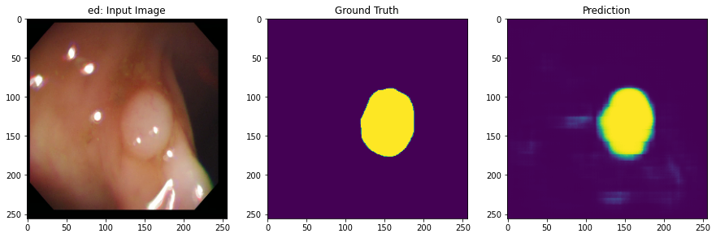
    


    
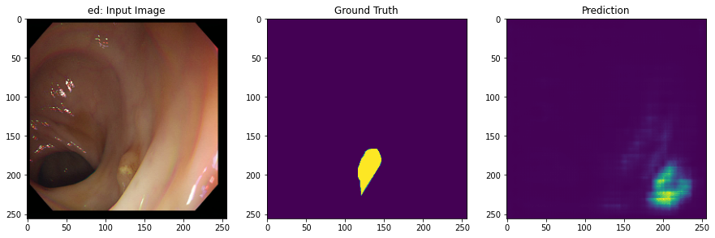
    


    
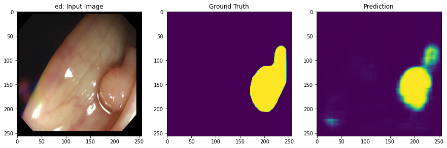
    


    
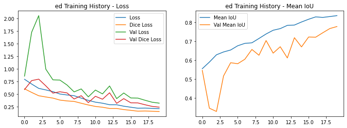
    


    
    === Training unet ===
    Epoch 1/20
    
    Epoch 00001: LearningRateScheduler setting learning rate to tf.Tensor(0.001, shape=(), dtype=float32).
    30/30 [==============================] - 30s 889ms/step - loss: 0.7642 - dice_loss: 0.5859 - mean_iou: 0.5737 - val_loss: 9.4161 - val_dice_loss: 0.8725 - val_mean_iou: 0.1807
    
    Epoch 00001: val_loss improved from inf to 9.41605, saving model to ./checkpoints/unet_model/ckpt-0001
    Epoch 2/20
    
    Epoch 00002: LearningRateScheduler setting learning rate to tf.Tensor(0.0009938442, shape=(), dtype=float32).
    30/30 [==============================] - 27s 859ms/step - loss: 0.6280 - dice_loss: 0.4800 - mean_iou: 0.6270 - val_loss: 8.8916 - val_dice_loss: 0.8722 - val_mean_iou: 0.1499
    
    Epoch 00002: val_loss improved from 9.41605 to 8.89165, saving model to ./checkpoints/unet_model/ckpt-0002
    Epoch 3/20
    
    Epoch 00003: LearningRateScheduler setting learning rate to tf.Tensor(0.00097552827, shape=(), dtype=float32).
    30/30 [==============================] - 28s 874ms/step - loss: 0.6015 - dice_loss: 0.4574 - mean_iou: 0.6359 - val_loss: 19.2492 - val_dice_loss: 0.8475 - val_mean_iou: 0.2416
    
    Epoch 00003: val_loss did not improve from 8.89165
    Epoch 4/20
    
    Epoch 00004: LearningRateScheduler setting learning rate to tf.Tensor(0.0009455033, shape=(), dtype=float32).
    30/30 [==============================] - 27s 857ms/step - loss: 0.5757 - dice_loss: 0.4414 - mean_iou: 0.6454 - val_loss: 30.4091 - val_dice_loss: 0.8575 - val_mean_iou: 0.2136
    
    Epoch 00004: val_loss did not improve from 8.89165
    Epoch 5/20
    
    Epoch 00005: LearningRateScheduler setting learning rate to tf.Tensor(0.0009045085, shape=(), dtype=float32).
    30/30 [==============================] - 27s 857ms/step - loss: 0.5092 - dice_loss: 0.3895 - mean_iou: 0.6728 - val_loss: 2.3142 - val_dice_loss: 0.7682 - val_mean_iou: 0.4200
    
    Epoch 00005: val_loss improved from 8.89165 to 2.31425, saving model to ./checkpoints/unet_model/ckpt-0005
    Epoch 6/20
    
    Epoch 00006: LearningRateScheduler setting learning rate to tf.Tensor(0.0008535535, shape=(), dtype=float32).
    30/30 [==============================] - 27s 866ms/step - loss: 0.4888 - dice_loss: 0.3694 - mean_iou: 0.6863 - val_loss: 2.6708 - val_dice_loss: 0.7784 - val_mean_iou: 0.4132
    
    Epoch 00006: val_loss did not improve from 2.31425
    Epoch 7/20
    
    Epoch 00007: LearningRateScheduler setting learning rate to tf.Tensor(0.00079389266, shape=(), dtype=float32).
    30/30 [==============================] - 27s 872ms/step - loss: 0.5036 - dice_loss: 0.3862 - mean_iou: 0.6746 - val_loss: 1.1952 - val_dice_loss: 0.6858 - val_mean_iou: 0.5242
    
    Epoch 00007: val_loss improved from 2.31425 to 1.19518, saving model to ./checkpoints/unet_model/ckpt-0007
    Epoch 8/20
    
    Epoch 00008: LearningRateScheduler setting learning rate to tf.Tensor(0.00072699535, shape=(), dtype=float32).
    30/30 [==============================] - 27s 852ms/step - loss: 0.4371 - dice_loss: 0.3326 - mean_iou: 0.7010 - val_loss: 1.2751 - val_dice_loss: 0.9545 - val_mean_iou: 0.4736
    
    Epoch 00008: val_loss did not improve from 1.19518
    Epoch 9/20
    
    Epoch 00009: LearningRateScheduler setting learning rate to tf.Tensor(0.0006545085, shape=(), dtype=float32).
    30/30 [==============================] - 28s 880ms/step - loss: 0.4184 - dice_loss: 0.3177 - mean_iou: 0.7178 - val_loss: 1.0248 - val_dice_loss: 0.8152 - val_mean_iou: 0.5023
    
    Epoch 00009: val_loss improved from 1.19518 to 1.02478, saving model to ./checkpoints/unet_model/ckpt-0009
    Epoch 10/20
    
    Epoch 00010: LearningRateScheduler setting learning rate to tf.Tensor(0.00057821727, shape=(), dtype=float32).
    30/30 [==============================] - 27s 857ms/step - loss: 0.3845 - dice_loss: 0.2928 - mean_iou: 0.7326 - val_loss: 0.6343 - val_dice_loss: 0.4288 - val_mean_iou: 0.6474
    
    Epoch 00010: val_loss improved from 1.02478 to 0.63426, saving model to ./checkpoints/unet_model/ckpt-0010
    Epoch 11/20
    
    Epoch 00011: LearningRateScheduler setting learning rate to tf.Tensor(0.00049999997, shape=(), dtype=float32).
    30/30 [==============================] - 28s 866ms/step - loss: 0.3609 - dice_loss: 0.2719 - mean_iou: 0.7455 - val_loss: 0.4464 - val_dice_loss: 0.3344 - val_mean_iou: 0.7134
    
    Epoch 00011: val_loss improved from 0.63426 to 0.44644, saving model to ./checkpoints/unet_model/ckpt-0011
    Epoch 12/20
    
    Epoch 00012: LearningRateScheduler setting learning rate to tf.Tensor(0.00042178275, shape=(), dtype=float32).
    30/30 [==============================] - 27s 862ms/step - loss: 0.3492 - dice_loss: 0.2631 - mean_iou: 0.7507 - val_loss: 0.5704 - val_dice_loss: 0.4222 - val_mean_iou: 0.6606
    
    Epoch 00012: val_loss did not improve from 0.44644
    Epoch 13/20
    
    Epoch 00013: LearningRateScheduler setting learning rate to tf.Tensor(0.00034549143, shape=(), dtype=float32).
    30/30 [==============================] - 27s 861ms/step - loss: 0.3402 - dice_loss: 0.2556 - mean_iou: 0.7576 - val_loss: 0.5670 - val_dice_loss: 0.4381 - val_mean_iou: 0.6598
    
    Epoch 00013: val_loss did not improve from 0.44644
    Epoch 14/20
    
    Epoch 00014: LearningRateScheduler setting learning rate to tf.Tensor(0.00027300484, shape=(), dtype=float32).
    30/30 [==============================] - 27s 860ms/step - loss: 0.2856 - dice_loss: 0.2149 - mean_iou: 0.7848 - val_loss: 0.5959 - val_dice_loss: 0.4667 - val_mean_iou: 0.6360
    
    Epoch 00014: val_loss did not improve from 0.44644
    Epoch 15/20
    
    Epoch 00015: LearningRateScheduler setting learning rate to tf.Tensor(0.00020610739, shape=(), dtype=float32).
    30/30 [==============================] - 27s 861ms/step - loss: 0.2621 - dice_loss: 0.1959 - mean_iou: 0.7994 - val_loss: 0.6320 - val_dice_loss: 0.5014 - val_mean_iou: 0.6247
    
    Epoch 00015: val_loss did not improve from 0.44644
    Epoch 16/20
    
    Epoch 00016: LearningRateScheduler setting learning rate to tf.Tensor(0.00014644662, shape=(), dtype=float32).
    30/30 [==============================] - 27s 865ms/step - loss: 0.2567 - dice_loss: 0.1924 - mean_iou: 0.8054 - val_loss: 0.5150 - val_dice_loss: 0.4041 - val_mean_iou: 0.6735
    
    Epoch 00016: val_loss did not improve from 0.44644
    Epoch 17/20
    
    Epoch 00017: LearningRateScheduler setting learning rate to tf.Tensor(9.549147e-05, shape=(), dtype=float32).
    30/30 [==============================] - 27s 864ms/step - loss: 0.2330 - dice_loss: 0.1734 - mean_iou: 0.8177 - val_loss: 0.4535 - val_dice_loss: 0.3540 - val_mean_iou: 0.6974
    
    Epoch 00017: val_loss did not improve from 0.44644
    Epoch 18/20
    
    Epoch 00018: LearningRateScheduler setting learning rate to tf.Tensor(5.4496708e-05, shape=(), dtype=float32).
    30/30 [==============================] - 27s 862ms/step - loss: 0.2265 - dice_loss: 0.1695 - mean_iou: 0.8235 - val_loss: 0.3858 - val_dice_loss: 0.2968 - val_mean_iou: 0.7341
    
    Epoch 00018: val_loss improved from 0.44644 to 0.38580, saving model to ./checkpoints/unet_model/ckpt-0018
    Epoch 19/20
    
    Epoch 00019: LearningRateScheduler setting learning rate to tf.Tensor(2.4471761e-05, shape=(), dtype=float32).
    30/30 [==============================] - 27s 863ms/step - loss: 0.2272 - dice_loss: 0.1695 - mean_iou: 0.8245 - val_loss: 0.3763 - val_dice_loss: 0.2881 - val_mean_iou: 0.7414
    
    Epoch 00019: val_loss improved from 0.38580 to 0.37629, saving model to ./checkpoints/unet_model/ckpt-0019
    Epoch 20/20
    
    Epoch 00020: LearningRateScheduler setting learning rate to tf.Tensor(6.155819e-06, shape=(), dtype=float32).
    30/30 [==============================] - 28s 866ms/step - loss: 0.2070 - dice_loss: 0.1539 - mean_iou: 0.8343 - val_loss: 0.3571 - val_dice_loss: 0.2716 - val_mean_iou: 0.7532
    
    Epoch 00020: val_loss improved from 0.37629 to 0.35713, saving model to ./checkpoints/unet_model/ckpt-0020
    
    === Evaluating unet ===
    
    === Visualizing unet results ===


    
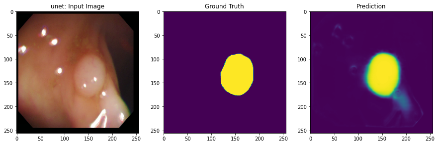
    


    
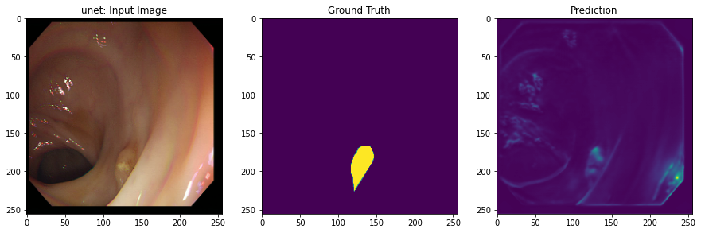
    


    
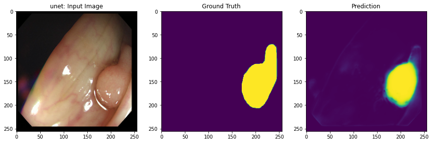
    


    
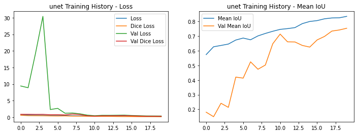
    


    
    === Training pretrained_unet ===
    Epoch 1/20
    
    Epoch 00001: LearningRateScheduler setting learning rate to tf.Tensor(0.001, shape=(), dtype=float32).
    30/30 [==============================] - 21s 592ms/step - loss: 0.6580 - dice_loss: 0.5029 - mean_iou: 0.6065 - val_loss: 0.9879 - val_dice_loss: 0.7616 - val_mean_iou: 0.4750
    
    Epoch 00001: val_loss improved from inf to 0.98786, saving model to ./checkpoints/pretrained_unet_model/ckpt-0001
    Epoch 2/20
    
    Epoch 00002: LearningRateScheduler setting learning rate to tf.Tensor(0.0009938442, shape=(), dtype=float32).
    30/30 [==============================] - 19s 581ms/step - loss: 0.5545 - dice_loss: 0.4217 - mean_iou: 0.6523 - val_loss: 0.8080 - val_dice_loss: 0.6062 - val_mean_iou: 0.5579
    
    Epoch 00002: val_loss improved from 0.98786 to 0.80799, saving model to ./checkpoints/pretrained_unet_model/ckpt-0002
    Epoch 3/20
    
    Epoch 00003: LearningRateScheduler setting learning rate to tf.Tensor(0.00097552827, shape=(), dtype=float32).
    30/30 [==============================] - 20s 587ms/step - loss: 0.5328 - dice_loss: 0.4053 - mean_iou: 0.6624 - val_loss: 1.2514 - val_dice_loss: 0.7620 - val_mean_iou: 0.4003
    
    Epoch 00003: val_loss did not improve from 0.80799
    Epoch 4/20
    
    Epoch 00004: LearningRateScheduler setting learning rate to tf.Tensor(0.0009455033, shape=(), dtype=float32).
    30/30 [==============================] - 19s 578ms/step - loss: 0.5101 - dice_loss: 0.3890 - mean_iou: 0.6702 - val_loss: 1.0950 - val_dice_loss: 0.7450 - val_mean_iou: 0.4491
    
    Epoch 00004: val_loss did not improve from 0.80799
    Epoch 5/20
    
    Epoch 00005: LearningRateScheduler setting learning rate to tf.Tensor(0.0009045085, shape=(), dtype=float32).
    30/30 [==============================] - 18s 574ms/step - loss: 0.4462 - dice_loss: 0.3396 - mean_iou: 0.7005 - val_loss: 1.0307 - val_dice_loss: 0.6764 - val_mean_iou: 0.4839
    
    Epoch 00005: val_loss did not improve from 0.80799
    Epoch 6/20
    
    Epoch 00006: LearningRateScheduler setting learning rate to tf.Tensor(0.0008535535, shape=(), dtype=float32).
    30/30 [==============================] - 19s 577ms/step - loss: 0.4359 - dice_loss: 0.3317 - mean_iou: 0.7055 - val_loss: 0.8843 - val_dice_loss: 0.7233 - val_mean_iou: 0.4982
    
    Epoch 00006: val_loss did not improve from 0.80799
    Epoch 7/20
    
    Epoch 00007: LearningRateScheduler setting learning rate to tf.Tensor(0.00079389266, shape=(), dtype=float32).
    30/30 [==============================] - 19s 581ms/step - loss: 0.4054 - dice_loss: 0.3061 - mean_iou: 0.7260 - val_loss: 0.7445 - val_dice_loss: 0.5736 - val_mean_iou: 0.5753
    
    Epoch 00007: val_loss improved from 0.80799 to 0.74450, saving model to ./checkpoints/pretrained_unet_model/ckpt-0007
    Epoch 8/20
    
    Epoch 00008: LearningRateScheduler setting learning rate to tf.Tensor(0.00072699535, shape=(), dtype=float32).
    30/30 [==============================] - 19s 579ms/step - loss: 0.3948 - dice_loss: 0.3002 - mean_iou: 0.7266 - val_loss: 0.7448 - val_dice_loss: 0.5955 - val_mean_iou: 0.5677
    
    Epoch 00008: val_loss did not improve from 0.74450
    Epoch 9/20
    
    Epoch 00009: LearningRateScheduler setting learning rate to tf.Tensor(0.0006545085, shape=(), dtype=float32).
    30/30 [==============================] - 19s 579ms/step - loss: 0.3677 - dice_loss: 0.2784 - mean_iou: 0.7435 - val_loss: 0.9232 - val_dice_loss: 0.7462 - val_mean_iou: 0.5149
    
    Epoch 00009: val_loss did not improve from 0.74450
    Epoch 10/20
    
    Epoch 00010: LearningRateScheduler setting learning rate to tf.Tensor(0.00057821727, shape=(), dtype=float32).
    30/30 [==============================] - 19s 579ms/step - loss: 0.3006 - dice_loss: 0.2251 - mean_iou: 0.7824 - val_loss: 0.5907 - val_dice_loss: 0.4512 - val_mean_iou: 0.6489
    
    Epoch 00010: val_loss improved from 0.74450 to 0.59073, saving model to ./checkpoints/pretrained_unet_model/ckpt-0010
    Epoch 11/20
    
    Epoch 00011: LearningRateScheduler setting learning rate to tf.Tensor(0.00049999997, shape=(), dtype=float32).
    30/30 [==============================] - 19s 575ms/step - loss: 0.3140 - dice_loss: 0.2345 - mean_iou: 0.7728 - val_loss: 0.5789 - val_dice_loss: 0.4160 - val_mean_iou: 0.6482
    
    Epoch 00011: val_loss improved from 0.59073 to 0.57888, saving model to ./checkpoints/pretrained_unet_model/ckpt-0011
    Epoch 12/20
    
    Epoch 00012: LearningRateScheduler setting learning rate to tf.Tensor(0.00042178275, shape=(), dtype=float32).
    30/30 [==============================] - 19s 586ms/step - loss: 0.2995 - dice_loss: 0.2252 - mean_iou: 0.7836 - val_loss: 0.6114 - val_dice_loss: 0.4730 - val_mean_iou: 0.6355
    
    Epoch 00012: val_loss did not improve from 0.57888
    Epoch 13/20
    
    Epoch 00013: LearningRateScheduler setting learning rate to tf.Tensor(0.00034549143, shape=(), dtype=float32).
    30/30 [==============================] - 19s 580ms/step - loss: 0.2709 - dice_loss: 0.2039 - mean_iou: 0.7997 - val_loss: 0.5256 - val_dice_loss: 0.3873 - val_mean_iou: 0.6725
    
    Epoch 00013: val_loss improved from 0.57888 to 0.52560, saving model to ./checkpoints/pretrained_unet_model/ckpt-0013
    Epoch 14/20
    
    Epoch 00014: LearningRateScheduler setting learning rate to tf.Tensor(0.00027300484, shape=(), dtype=float32).
    30/30 [==============================] - 19s 577ms/step - loss: 0.2481 - dice_loss: 0.1838 - mean_iou: 0.8130 - val_loss: 0.5654 - val_dice_loss: 0.4390 - val_mean_iou: 0.6494
    
    Epoch 00014: val_loss did not improve from 0.52560
    Epoch 15/20
    
    Epoch 00015: LearningRateScheduler setting learning rate to tf.Tensor(0.00020610739, shape=(), dtype=float32).
    30/30 [==============================] - 19s 579ms/step - loss: 0.2223 - dice_loss: 0.1637 - mean_iou: 0.8293 - val_loss: 0.4425 - val_dice_loss: 0.3371 - val_mean_iou: 0.7063
    
    Epoch 00015: val_loss improved from 0.52560 to 0.44254, saving model to ./checkpoints/pretrained_unet_model/ckpt-0015
    Epoch 16/20
    
    Epoch 00016: LearningRateScheduler setting learning rate to tf.Tensor(0.00014644662, shape=(), dtype=float32).
    30/30 [==============================] - 19s 578ms/step - loss: 0.2169 - dice_loss: 0.1607 - mean_iou: 0.8337 - val_loss: 0.4540 - val_dice_loss: 0.3451 - val_mean_iou: 0.7021
    
    Epoch 00016: val_loss did not improve from 0.44254
    Epoch 17/20
    
    Epoch 00017: LearningRateScheduler setting learning rate to tf.Tensor(9.549147e-05, shape=(), dtype=float32).
    30/30 [==============================] - 19s 581ms/step - loss: 0.1951 - dice_loss: 0.1430 - mean_iou: 0.8471 - val_loss: 0.3974 - val_dice_loss: 0.3010 - val_mean_iou: 0.7296
    
    Epoch 00017: val_loss improved from 0.44254 to 0.39742, saving model to ./checkpoints/pretrained_unet_model/ckpt-0017
    Epoch 18/20
    
    Epoch 00018: LearningRateScheduler setting learning rate to tf.Tensor(5.4496708e-05, shape=(), dtype=float32).
    30/30 [==============================] - 19s 576ms/step - loss: 0.1895 - dice_loss: 0.1393 - mean_iou: 0.8515 - val_loss: 0.3815 - val_dice_loss: 0.2859 - val_mean_iou: 0.7387
    
    Epoch 00018: val_loss improved from 0.39742 to 0.38145, saving model to ./checkpoints/pretrained_unet_model/ckpt-0018
    Epoch 19/20
    
    Epoch 00019: LearningRateScheduler setting learning rate to tf.Tensor(2.4471761e-05, shape=(), dtype=float32).
    30/30 [==============================] - 19s 577ms/step - loss: 0.1851 - dice_loss: 0.1353 - mean_iou: 0.8537 - val_loss: 0.3419 - val_dice_loss: 0.2538 - val_mean_iou: 0.7592
    
    Epoch 00019: val_loss improved from 0.38145 to 0.34194, saving model to ./checkpoints/pretrained_unet_model/ckpt-0019
    Epoch 20/20
    
    Epoch 00020: LearningRateScheduler setting learning rate to tf.Tensor(6.155819e-06, shape=(), dtype=float32).
    30/30 [==============================] - 19s 580ms/step - loss: 0.1796 - dice_loss: 0.1312 - mean_iou: 0.8571 - val_loss: 0.3244 - val_dice_loss: 0.2393 - val_mean_iou: 0.7702
    
    Epoch 00020: val_loss improved from 0.34194 to 0.32440, saving model to ./checkpoints/pretrained_unet_model/ckpt-0020
    
    === Evaluating pretrained_unet ===
    
    === Visualizing pretrained_unet results ===


    
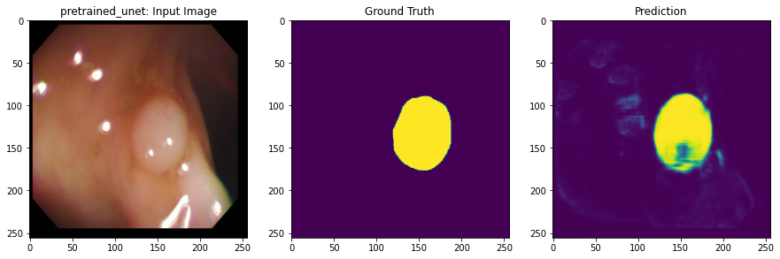
    


    
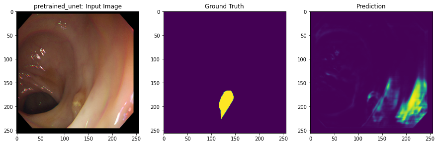
    


    
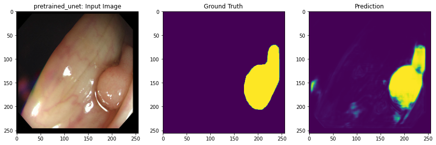
    


    
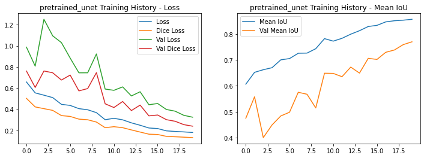
    


    
    === Final Results ===
    
    ed:
    Mean IoU: 0.7883
    Final Val Loss: 0.3190
    
    unet:
    Mean IoU: 0.7684
    Final Val Loss: 0.3571
    
    pretrained_unet:
    Mean IoU: 0.7843
    Final Val Loss: 0.3244


### 모델 간 성능차이 시각화


```python
def collect_and_plot_results():
    # 결과 수집
    results = {}
    
    for model_name, config in model_configs.items():
        model = config['model']
        mean_ious = []
        
        # 테스트 데이터셋에 대한 평가
        for images, labels in test_dataset:
            predictions = model(images, training=False)
            m = mean_iou(labels, predictions)
            mean_ious.append(m)
        
        # 평균 IoU 계산
        avg_iou = tf.reduce_mean(mean_ious)
        
        results[model_name] = {
            'mean_iou': float(avg_iou),
            'model': model
        }
        
        print(f"{model_name} Mean IoU: {float(avg_iou):.4f}")
    
    # 결과 시각화
    plot_model_comparison(results)
    
    return results

def plot_model_comparison(results):
    models = list(results.keys())
    mean_ious = [results[m]['mean_iou'] for m in models]
    
    plt.figure(figsize=(10, 6))
    plt.bar(models, mean_ious)
    plt.title('Model Comparison - Mean IoU')
    plt.ylabel('Mean IoU')
    
    # 각 막대 위에 수치 표시
    for i, v in enumerate(mean_ious):
        plt.text(i, v + 0.01, f'{v:.4f}', 
                ha='center', va='bottom')
    
    plt.ylim(0, max(mean_ious) + 0.1)  # y축 범위 조정
    plt.show()

# 실행
results = collect_and_plot_results()
```

    ed Mean IoU: 0.7883
    unet Mean IoU: 0.7684
    pretrained_unet Mean IoU: 0.7843


    
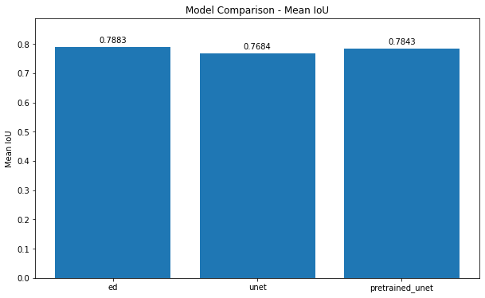
    


## **Restore the latest checkpoint**


## **Evaluate the test dataset**


```python
# 모델 로드 함수 정의
def load_saved_models():
    model_checkpoints = {
        'ed': './checkpoints/ed_model',
        'unet': './checkpoints/unet_model',
        'pretrained_unet': './checkpoints/pretrained_unet_model'
    }
    
    loaded_models = {}
    for model_name, checkpoint_path in model_checkpoints.items():
        print(f"\nLoading {model_name} model...")
        if model_name == 'ed':
            model = ed_model
        elif model_name == 'unet':
            model = unet_model
        else:
            model = pretrained_unet
            
        # 모델 컴파일
        model.compile(optimizer='adam',
                     loss=bce_dice_loss,
                     metrics=[dice_loss, mean_iou])
        
        # 저장된 가중치 로드
        try:
            model.load_weights(checkpoint_path)
            print(f"Successfully loaded weights for {model_name}")
            loaded_models[model_name] = model
        except:
            print(f"No saved weights found for {model_name}")
            continue
    
    return loaded_models

# 저장된 모델들을 로드하여 비교
def compare_saved_models():
    # 저장된 모델 로드
    models = load_saved_models()
    
    if not models:
        print("No saved models found!")
        return
        
    # 테스트 데이터로 성능 평가
    results = {}
    for model_name, model in models.items():
        print(f"\nEvaluating {model_name}...")
        mean_ious = []
        
        for images, labels in test_dataset:
            predictions = model(images, training=False)
            m = mean_iou(labels, predictions)
            mean_ious.append(m)
        
        avg_iou = np.mean(mean_ious)
        results[model_name] = avg_iou
        print(f"{model_name} Mean IoU: {avg_iou:.4f}")
    
    # 시각적 비교
    for test_images, test_labels in test_dataset.take(1):
        plt.figure(figsize=(15, 5*len(models)))
        
        for idx, (model_name, model) in enumerate(models.items()):
            predictions = model(test_images, training=False)
            
            # 첫 번째 이미지에 대해서만 비교
            plt.subplot(len(models), 3, idx*3 + 1)
            plt.imshow(test_images[0])
            plt.title(f"{model_name}: Input")
            
            plt.subplot(len(models), 3, idx*3 + 2)
            plt.imshow(test_labels[0, :, :, 0])
            plt.title("Ground Truth")
            
            plt.subplot(len(models), 3, idx*3 + 3)
            plt.imshow(predictions[0, :, :, 0])
            plt.title(f"Prediction (IoU: {results[model_name]:.3f})")
        
        plt.tight_layout()
        plt.show()
    
    # 성능 비교 그래프
    plt.figure(figsize=(10, 6))
    plt.bar(results.keys(), results.values())
    plt.title('Model Performance Comparison')
    plt.ylabel('Mean IoU')
    plt.ylim(0, 1)
    for i, v in enumerate(results.values()):
        plt.text(i, v + 0.01, f'{v:.3f}', ha='center')
    plt.show()

# 실행
compare_saved_models()
```

    
    Loading ed model...
    No saved weights found for ed
    
    Loading unet model...
    No saved weights found for unet
    
    Loading pretrained_unet model...
    No saved weights found for pretrained_unet
    No saved models found!


### 세 모델의 체계적 비교 분석


```python
def comprehensive_model_comparison():
    # 1. 학습 과정 비교
    plt.figure(figsize=(15, 5))
    
    # Loss 비교
    plt.subplot(1, 3, 1)
    for model_name in model_configs:
        history = model_configs[model_name]['history']
        plt.plot(history.history['val_loss'], label=model_name)
    plt.title('Validation Loss Comparison')
    plt.legend()
    
    # Mean IoU 비교
    plt.subplot(1, 3, 2)
    for model_name in model_configs:
        history = model_configs[model_name]['history']
        plt.plot(history.history['val_mean_iou'], label=model_name)
    plt.title('Validation Mean IoU Comparison')
    plt.legend()
    
    # Dice Loss 비교
    plt.subplot(1, 3, 3)
    for model_name in model_configs:
        history = model_configs[model_name]['history']
        plt.plot(history.history['val_dice_loss'], label=model_name)
    plt.title('Validation Dice Loss Comparison')
    plt.legend()
    
    plt.tight_layout()
    plt.show()
    
    # 2. 최종 성능 비교 테이블
    results_table = {
        'Model': [],
        'Final Val Loss': [],
        'Final Mean IoU': [],
        'Final Dice Loss': []
    }
    
    for model_name in model_configs:
        history = model_configs[model_name]['history']
        results_table['Model'].append(model_name)
        results_table['Final Val Loss'].append(history.history['val_loss'][-1])
        results_table['Final Mean IoU'].append(history.history['val_mean_iou'][-1])
        results_table['Final Dice Loss'].append(history.history['val_dice_loss'][-1])
    
    # 3. 시각적 세그멘테이션 결과 비교
    def compare_segmentation_results():
        for test_images, test_labels in test_dataset.take(1):
            plt.figure(figsize=(15, 5*len(model_configs)))
            for idx, (model_name, config) in enumerate(model_configs.items()):
                predictions = config['model'](test_images, training=False)
                
                # 첫 번째 이미지에 대해서만 비교
                plt.subplot(len(model_configs), 3, idx*3 + 1)
                plt.imshow(test_images[0])
                plt.title(f"{model_name}: Input")
                
                plt.subplot(len(model_configs), 3, idx*3 + 2)
                plt.imshow(test_labels[0, :, :, 0])
                plt.title("Ground Truth")
                
                plt.subplot(len(model_configs), 3, idx*3 + 3)
                plt.imshow(predictions[0, :, :, 0])
                plt.title(f"Prediction (IoU: {mean_iou(test_labels[0:1], predictions[0:1]):.3f})")
            
            plt.tight_layout()
            plt.show()
    
    compare_segmentation_results()
```


```python
comprehensive_model_comparison()
```


    
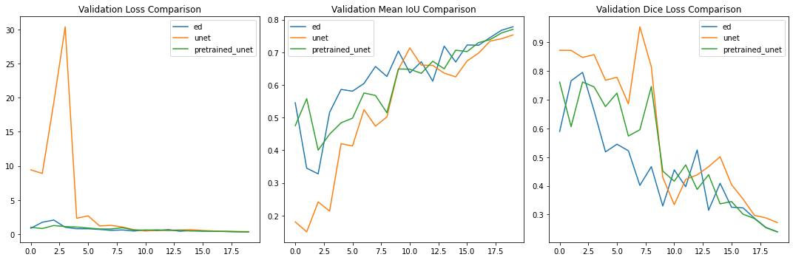
    


    
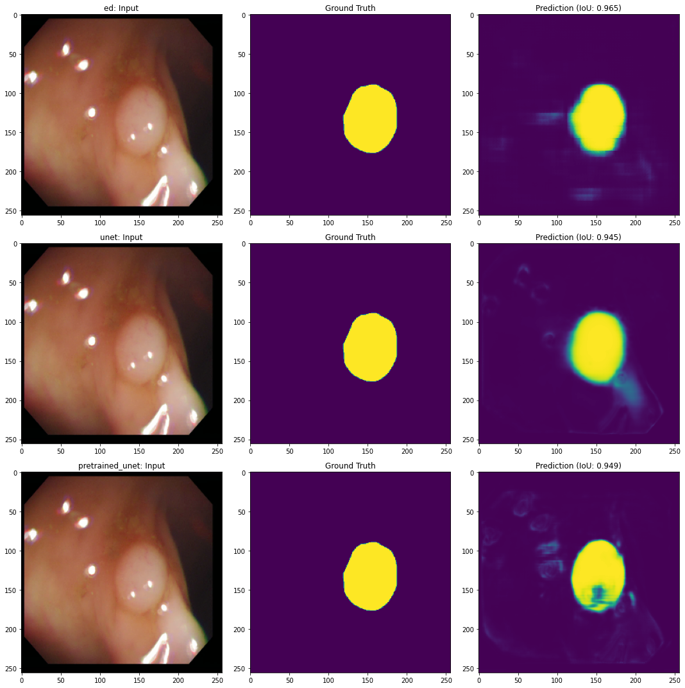
    


STEP 1 : 데이터셋 구성  

오늘 실습에서 활용하였던 Giana 데이터셋을 그대로 활용하여, augmentation을 위한 파이프라인 구성 및 tf.data.Dataset을 이용한 배치처리를 통해 학습/테스트 데이터셋을 구성합니다.


STEP 2 : pretrained model을 활용한 U-Net 모델 구성  

Encoder를 pretrained 모델로 변경하는 작업을 어떻게 진행하면 좋을까요? 아래 예시는 VGG16을 활용하기 위한 것입니다. 마음에 드는 다른 모델을 활용하기 위해 다양하게 시도해 보는 것을 권장합니다.

우선 VGG16 모델의 레이어 구성을 확인해 봅시다. U-Net이란 Encoder와 Decoder 사이의 대응되는 레이어간의 skip connection이 특징인 모델입니다. 여기서 Encoder를 pretrained model로 바꿔주려면 Encoder로 활용할 모델의 레이어 구성을 눈여겨 봐야겠죠?

STEP 3 : 학습과 테스트, 시각화   

모델을 변경하여 실습과정과 동일하게 학습과 테스트, 시각화를 진행합니다.

STEP 4 : 모델 성능 비교분석  

Encoder-Decoder 모델, U-Net 모델, Pretrained U-Net 모델 이상 3가지에 대해 학습 진행과정, 정량/정성적 테스트 결과를 포함한 비교분석을 진행하여 봅니다.

### 평가 루브릭
평가문항	상세기준
1. 의료영상 데이터의 전처리 및 augmentation을 위한 파이프라인 구성이 체계적으로 진행되었는가?	augmentation이 반영된 tf.data.Dataset 구성이 정상적으로 진행되었다.
2. U-Net의 개선 모델을 구현하여 적용 후 기존 U-Net 대비 성능 개선을 확인하였는가?	U-Net 개선 모델의 학습 과정이 정상적으로 진행되었으며, validation meanIoU가 기존 U-Net보다 좋아짐을 확인하였다.
3. 3가지 모델에 대한 학습과정, 테스트 결과를 체계적으로 비교분석하였는가?	loss 그래프, meanIoU 계산, segmentation 결과 시각화 등이 3가지 모델에 대해 수행된 후 결과 비교분석이 제시되었다.

# 회고 

의료 영상 세그멘테이션을 위한 딥러닝 모델 구현 과정에서 상당히 흥미로운 인사이트를 얻을 수 있었다. 먼저 데이터 전처리 단계에서 의료 영상의 특수성을 고려한 augmentation 기법들을 적용하면서, 도메인 특화된 데이터 처리의 중요성을 체감했다. tf.data API를 활용한 효율적인 데이터 파이프라인 구축을 보다더 메뉴얼화 하는 시간이 되었다. 
 
아키텍처 측면에서는 기본적인 Encoder-Decoder 구조에서 시작하여 U-Net, 그리고 VGG16을 백본으로 활용한 Pretrained U-Net까지 구현하면서 모델 아키텍처의 진화 과정을 깊이 있게 이해할 수 있었다. 특히 Skip Connection의 도입이 feature map의 공간 정보 보존에 미치는 영향을 실험적으로 검증할 수 있었고, 이는 세그멘테이션 태스크에서 왜 U-Net 구조가 표준이 되었는지 직관적으로 이해하는 계기가 되었다.
 
또한, 전이학습의 효과를 정량적으로 분석하면서, ImageNet으로 사전학습된 가중치가 의료 영상이라는 전혀 다른 도메인에서도 유의미한 성능 향상을 가져온다는 점이 인상적이었다. 이는 저수준 특징의 일반화 가능성을 입증한다고 생각한다. 
 
세 가지 모델의 성능을 meanIoU와 같은 정량적 지표와 함께 시각화를 통한 정성적 분석을 수행하면서, 의료 영상 처리에서 세그멘테이션의 실질적 응용 가능성과 한계점을 고찰할 수 있었다. 특히 경계가 모호한 영역에서의 세그멘테이션 성능 차이나, 작은 구조물의 검출 능력 등을 비교하면서 각 모델의 특성을 확실히 정립하게 되었다. 그리고 비교분석을 위한 다양한 모듈을 시도하면서 분석을 위한 알고리즘의 스팩트럼을 확실히 넓힐 수 있었다. 
 
마지막으로, 이번 프로젝트를 통해 딥러닝 모델의 구현과 최적화뿐만 아니라, 의료 영상이라는 개인적으로도 관심이 큰 도메인에서의 AI활용의 가치에 대해 또 헬스케어 분야에서의 기여라는 측면에서 생각을 정리할 수 있었고 앞으로 관련 프로젝트에 대한 자신감을 더 공고히 할 수 있었고 이제 실제적인 도전을 기획해보고 싶다.  


# Pretrained U-Net 성능 추가 개선 전략

1. 데이터 Augmentation 강화:


```python
def enhanced_augmentation(image, mask):
    # 기존 augmentation
    if tf.random.uniform(()) > 0.5:
        image = tf.image.flip_left_right(image)
        mask = tf.image.flip_left_right(mask)
    
    # 추가적인 augmentation
    # 회전
    if tf.random.uniform(()) > 0.5:
        angle = tf.random.uniform([], -20, 20) * math.pi / 180
        image = tfa.image.rotate(image, angle)
        mask = tfa.image.rotate(mask, angle)
    
    # 밝기 조정
    image = tf.image.random_brightness(image, 0.2)
    
    # 대비 조정
    image = tf.image.random_contrast(image, 0.8, 1.2)
    
    # 노이즈 추가
    noise = tf.random.normal(shape=tf.shape(image), mean=0.0, stddev=0.01)
    image = tf.clip_by_value(image + noise, 0.0, 1.0)
    
    return image, mask
```

2. 학습률 스케줄링 최적화:


```python
def get_callbacks():
    # Cosine Decay with Warm Restarts
    initial_lr = 1e-3
    min_lr = 1e-6
    decay_steps = num_train_examples // batch_size * 5  # 5 에포크마다 재시작
    
    lr_schedule = tf.keras.experimental.CosineDecayRestarts(
        initial_learning_rate=initial_lr,
        first_decay_steps=decay_steps,
        t_mul=2.0,  # 재시작 주기를 2배씩 증가
        m_mul=0.9,  # 최대 학습률을 0.9배씩 감소
        alpha=min_lr/initial_lr
    )
    
    callbacks = [
        tf.keras.callbacks.LearningRateScheduler(lr_schedule),
        tf.keras.callbacks.ModelCheckpoint(
            filepath='best_model/pretrained_unet',
            save_best_only=True,
            monitor='val_mean_iou',
            mode='max'
        ),
        tf.keras.callbacks.EarlyStopping(
            monitor='val_mean_iou',
            patience=10,
            restore_best_weights=True
        )
    ]
    return callbacks
```

3. 손실 함수 개선:


```python
def combined_loss(y_true, y_pred):
    # BCE + Dice Loss에 Focal Loss 추가
    alpha = 0.25
    gamma = 2.0
    
    # Focal Loss
    focal_loss = -alpha * (1 - y_pred) ** gamma * y_true * tf.math.log(y_pred + 1e-7)
    focal_loss = tf.reduce_mean(focal_loss)
    
    # 기존 BCE + Dice Loss
    bce_dice = bce_dice_loss(y_true, y_pred)
    
    return bce_dice + 0.5 * focal_loss
```

4. 모델 아키텍처 개선:


```python
def create_enhanced_pretrained_unet(input_shape=(256, 256, 3)):
    # VGG16 인코더 로드
    base_model = tf.keras.applications.VGG16(
        include_top=False,
        weights='imagenet',
        input_shape=input_shape
    )
    
    # Attention 메커니즘 추가
    def attention_block(x, g, inter_channel):
        theta_x = Conv2D(inter_channel, 1)(x)
        phi_g = Conv2D(inter_channel, 1)(g)
        
        f = Activation('relu')(Add()([theta_x, phi_g]))
        psi_f = Conv2D(1, 1)(f)
        rate = Activation('sigmoid')(psi_f)
        
        return Multiply()([x, rate])
    
    # Skip connections with attention
    skip_connections = []
    for layer in base_model.layers:
        if layer.name in ['block1_conv2', 'block2_conv2', 'block3_conv3', 'block4_conv3']:
            skip_connections.append(layer.output)
    
    # 디코더에 Attention 추가
    x = base_model.output
    for skip in reversed(skip_connections):
        x = Conv2DTranspose(x.shape[-1]//2, (2, 2), strides=(2, 2))(x)
        x = attention_block(skip, x, x.shape[-1])
        x = Concatenate()([x, skip])
        x = Conv2D(x.shape[-1]//2, 3, padding='same', activation='relu')(x)
        x = BatchNormalization()(x)
        x = Dropout(0.3)(x)
    
    outputs = Conv2D(1, 1, activation='sigmoid')(x)
    model = Model(inputs=base_model.input, outputs=outputs)
    
    return model
```

5. 학습 전략 최적화:


```python
def train_enhanced_pretrained_unet():
    # 모델 생성
    model = create_enhanced_pretrained_unet()
    
    # Progressive Learning
    image_sizes = [(128, 128), (192, 192), (256, 256)]
    epochs_per_stage = [5, 5, 10]
    
    for size, epochs in zip(image_sizes, epochs_per_stage):
        print(f"\nTraining at resolution {size}")
        
        # 데이터셋 리사이즈
        train_ds = train_dataset.map(
            lambda x, y: (tf.image.resize(x, size), tf.image.resize(y, size))
        )
        valid_ds = valid_dataset.map(
            lambda x, y: (tf.image.resize(x, size), tf.image.resize(y, size))
        )
        
        # 컴파일 및 학습
        model.compile(
            optimizer=tf.keras.optimizers.Adam(1e-4),
            loss=combined_loss,
            metrics=[mean_iou, dice_loss]
        )
        
        model.fit(
            train_ds,
            epochs=epochs,
            validation_data=valid_ds,
            callbacks=get_callbacks()
        )
    
    return model
```

6. 추론 시 Test Time Augmentation (TTA) 적용:


```python
def tta_predict(model, image, num_augments=5):
    predictions = []
    
    # 원본 예측
    predictions.append(model.predict(image))
    
    # 다양한 augmentation 적용 후 예측
    for _ in range(num_augments-1):
        aug_image = tf.image.flip_left_right(image)
        pred = model.predict(aug_image)
        pred = tf.image.flip_left_right(pred)
        predictions.append(pred)
        
        aug_image = tfa.image.rotate(image, tf.random.uniform([], -10, 10) * math.pi / 180)
        predictions.append(model.predict(aug_image))
    
    # 앙상블
    return tf.reduce_mean(predictions, axis=0)
```

7. 성능평가 및 결과 시각화


```python
# 향상된 pretrained 모델 학습
enhanced_model = train_enhanced_pretrained_unet()

# 성능 평가
test_images = next(iter(test_dataset))[0]
predictions = tta_predict(enhanced_model, test_images)

# 결과 시각화 및 성능 측정
visualize_results(test_images, predictions)
evaluate_performance(enhanced_model, test_dataset)
```


    ---------------------------------------------------------------------------

    NameError                                 Traceback (most recent call last)

    /tmp/ipykernel_101/2760261018.py in <module>
          1 # 향상된 pretrained 모델 학습
    ----> 2 enhanced_model = train_enhanced_pretrained_unet()
          3 
          4 # 성능 평가
          5 test_images = next(iter(test_dataset))[0]


    /tmp/ipykernel_101/2158559915.py in train_enhanced_pretrained_unet()
          1 def train_enhanced_pretrained_unet():
          2     # 모델 생성
    ----> 3     model = create_enhanced_pretrained_unet()
          4 
          5     # Progressive Learning


    /tmp/ipykernel_101/2229420740.py in create_enhanced_pretrained_unet(input_shape)
         27     x = base_model.output
         28     for skip in reversed(skip_connections):
    ---> 29         x = Conv2DTranspose(x.shape[-1]//2, (2, 2), strides=(2, 2))(x)
         30         x = attention_block(skip, x, x.shape[-1])
         31         x = Concatenate()([x, skip])


    NameError: name 'Conv2DTranspose' is not defined


```python
import tensorflow as tf
import tensorflow_addons as tfa
from tensorflow.keras.layers import (
    Conv2D, Conv2DTranspose, Input, MaxPooling2D, 
    concatenate, Dropout, BatchNormalization, 
    Activation, Add, Multiply, Concatenate
)
from tensorflow.keras.models import Model
import numpy as np
import matplotlib.pyplot as plt
import math
import os

# 1. 데이터 Augmentation 강화
def enhanced_augmentation(image, mask):
    # 기존 augmentation
    if tf.random.uniform(()) > 0.5:
        image = tf.image.flip_left_right(image)
        mask = tf.image.flip_left_right(mask)
    
    # 추가적인 augmentation
    # 회전
    if tf.random.uniform(()) > 0.5:
        angle = tf.random.uniform([], -20, 20) * math.pi / 180
        image = tfa.image.rotate(image, angle)
        mask = tfa.image.rotate(mask, angle)
    
    # 밝기 조정
    image = tf.image.random_brightness(image, 0.2)
    
    # 대비 조정
    image = tf.image.random_contrast(image, 0.8, 1.2)
    
    # 노이즈 추가
    noise = tf.random.normal(shape=tf.shape(image), mean=0.0, stddev=0.01)
    image = tf.clip_by_value(image + noise, 0.0, 1.0)
    
    return image, mask

# 2. 학습률 스케줄링 최적화
def get_optimized_lr_schedule():
    initial_lr = 1e-3
    min_lr = 1e-6
    decay_steps = num_train_examples // batch_size * 5
    
    lr_schedule = tf.keras.experimental.CosineDecayRestarts(
        initial_learning_rate=initial_lr,
        first_decay_steps=decay_steps,
        t_mul=2.0,
        m_mul=0.9,
        alpha=min_lr/initial_lr
    )
    
    return lr_schedule

# 3. 손실 함수 개선
def combined_loss(y_true, y_pred):
    alpha = 0.25
    gamma = 2.0
    
    # Focal Loss
    focal_loss = -alpha * (1 - y_pred) ** gamma * y_true * tf.math.log(y_pred + 1e-7)
    focal_loss = tf.reduce_mean(focal_loss)
    
    # 기존 BCE + Dice Loss
    bce_dice = bce_dice_loss(y_true, y_pred)
    
    return bce_dice + 0.5 * focal_loss

# 4. 모델 아키텍처 개선
def create_enhanced_pretrained_unet(input_shape=(256, 256, 3)):
    base_model = tf.keras.applications.VGG16(
        include_top=False,
        weights='imagenet',
        input_shape=input_shape
    )
    
    # Attention 블록 정의
    def attention_block(x, g, inter_channel):
        theta_x = Conv2D(inter_channel, 1)(x)
        phi_g = Conv2D(inter_channel, 1)(g)
        
        f = Activation('relu')(Add()([theta_x, phi_g]))
        psi_f = Conv2D(1, 1)(f)
        rate = Activation('sigmoid')(psi_f)
        
        return Multiply()([x, rate])
    
    # Skip connections with attention
    skip_connections = []
    for layer in base_model.layers:
        if layer.name in ['block1_conv2', 'block2_conv2', 'block3_conv3', 'block4_conv3']:
            skip_connections.append(layer.output)
    
    x = base_model.output
    for skip in reversed(skip_connections):
        x = Conv2DTranspose(x.shape[-1]//2, (2, 2), strides=(2, 2))(x)
        x = attention_block(skip, x, x.shape[-1])
        x = Concatenate()([x, skip])
        x = Conv2D(x.shape[-1]//2, 3, padding='same', activation='relu')(x)
        x = BatchNormalization()(x)
        x = Dropout(0.3)(x)
    
    outputs = Conv2D(1, 1, activation='sigmoid')(x)
    model = Model(inputs=base_model.input, outputs=outputs)
    
    return model

# 5. 학습 전략 최적화
def train_enhanced_model():
    # 모델 생성
    model = create_enhanced_pretrained_unet()
    
    # Progressive Learning 설정
    image_sizes = [(128, 128), (192, 192), (256, 256)]
    epochs_per_stage = [5, 5, 10]
    
    for size, epochs in zip(image_sizes, epochs_per_stage):
        print(f"\nTraining at resolution {size}")
        
        # 데이터셋 리사이즈
        train_ds = train_dataset.map(
            lambda x, y: (tf.image.resize(x, size), tf.image.resize(y, size))
        ).map(enhanced_augmentation)
        
        valid_ds = valid_dataset.map(
            lambda x, y: (tf.image.resize(x, size), tf.image.resize(y, size))
        )
        
        # 컴파일
        model.compile(
            optimizer=tf.keras.optimizers.Adam(get_optimized_lr_schedule()),
            loss=combined_loss,
            metrics=[mean_iou, dice_coeff]
        )
        
        # 학습
        history = model.fit(
            train_ds,
            epochs=epochs,
            validation_data=valid_ds,
            callbacks=[
                tf.keras.callbacks.ModelCheckpoint(
                    'best_model/enhanced_pretrained',
                    save_best_only=True,
                    monitor='val_mean_iou',
                    mode='max'
                ),
                tf.keras.callbacks.EarlyStopping(
                    monitor='val_mean_iou',
                    patience=5,
                    restore_best_weights=True
                )
            ]
        )
    
    return model, history

# 6. Test Time Augmentation
def tta_predict(model, image, num_augments=5):
    predictions = []
    
    # 원본 예측
    predictions.append(model.predict(image))
    
    # 다양한 augmentation 적용 후 예측
    for _ in range(num_augments-1):
        # 좌우 뒤집기
        aug_image = tf.image.flip_left_right(image)
        pred = model.predict(aug_image)
        pred = tf.image.flip_left_right(pred)
        predictions.append(pred)
        
        # 회전
        angle = tf.random.uniform([], -10, 10) * math.pi / 180
        aug_image = tfa.image.rotate(image, angle)
        predictions.append(model.predict(aug_image))
    
    # 앙상블
    return tf.reduce_mean(predictions, axis=0)

# 7. 전체 실행 및 평가
def run_enhanced_training():
    print("Starting enhanced training process...")
    
    # 모델 학습
    enhanced_model, history = train_enhanced_model()
    
    # 원본 모델과 성능 비교
    comparison_results = compare_pretrained_models(
        model_configs['pretrained_unet']['model'],
        enhanced_model,
        test_dataset
    )
    
    return enhanced_model, history, comparison_results

# 실행
import tensorflow_addons as tfa
enhanced_model, history, results = run_enhanced_training()
```

    Starting enhanced training process...


    ---------------------------------------------------------------------------

    ValueError                                Traceback (most recent call last)

    /tmp/ipykernel_101/980338987.py in <module>
        198 # 실행
        199 import tensorflow_addons as tfa
    --> 200 enhanced_model, history, results = run_enhanced_training()
    

    /tmp/ipykernel_101/980338987.py in run_enhanced_training()
        185 
        186     # 모델 학습
    --> 187     enhanced_model, history = train_enhanced_model()
        188 
        189     # 원본 모델과 성능 비교


    /tmp/ipykernel_101/980338987.py in train_enhanced_model()
        110 def train_enhanced_model():
        111     # 모델 생성
    --> 112     model = create_enhanced_pretrained_unet()
        113 
        114     # Progressive Learning 설정


    /tmp/ipykernel_101/980338987.py in create_enhanced_pretrained_unet(input_shape)
         96     for skip in reversed(skip_connections):
         97         x = Conv2DTranspose(x.shape[-1]//2, (2, 2), strides=(2, 2))(x)
    ---> 98         x = attention_block(skip, x, x.shape[-1])
         99         x = Concatenate()([x, skip])
        100         x = Conv2D(x.shape[-1]//2, 3, padding='same', activation='relu')(x)


    /tmp/ipykernel_101/980338987.py in attention_block(x, g, inter_channel)
         81         phi_g = Conv2D(inter_channel, 1)(g)
         82 
    ---> 83         f = Activation('relu')(Add()([theta_x, phi_g]))
         84         psi_f = Conv2D(1, 1)(f)
         85         rate = Activation('sigmoid')(psi_f)


    /opt/conda/lib/python3.9/site-packages/keras/engine/base_layer.py in __call__(self, *args, **kwargs)
        974     # >> model = tf.keras.Model(inputs, outputs)
        975     if _in_functional_construction_mode(self, inputs, args, kwargs, input_list):
    --> 976       return self._functional_construction_call(inputs, args, kwargs,
        977                                                 input_list)
        978 


    /opt/conda/lib/python3.9/site-packages/keras/engine/base_layer.py in _functional_construction_call(self, inputs, args, kwargs, input_list)
       1112         layer=self, inputs=inputs, build_graph=True, training=training_value):
       1113       # Check input assumptions set after layer building, e.g. input shape.
    -> 1114       outputs = self._keras_tensor_symbolic_call(
       1115           inputs, input_masks, args, kwargs)
       1116 


    /opt/conda/lib/python3.9/site-packages/keras/engine/base_layer.py in _keras_tensor_symbolic_call(self, inputs, input_masks, args, kwargs)
        846       return tf.nest.map_structure(keras_tensor.KerasTensor, output_signature)
        847     else:
    --> 848       return self._infer_output_signature(inputs, args, kwargs, input_masks)
        849 
        850   def _infer_output_signature(self, inputs, args, kwargs, input_masks):


    /opt/conda/lib/python3.9/site-packages/keras/engine/base_layer.py in _infer_output_signature(self, inputs, args, kwargs, input_masks)
        884           # overridden).
        885           # TODO(kaftan): do we maybe_build here, or have we already done it?
    --> 886           self._maybe_build(inputs)
        887           inputs = self._maybe_cast_inputs(inputs)
        888           outputs = call_fn(inputs, *args, **kwargs)


    /opt/conda/lib/python3.9/site-packages/keras/engine/base_layer.py in _maybe_build(self, inputs)
       2657         # operations.
       2658         with tf_utils.maybe_init_scope(self):
    -> 2659           self.build(input_shapes)  # pylint:disable=not-callable
       2660       # We must set also ensure that the layer is marked as built, and the build
       2661       # shape is stored since user defined build functions may not be calling


    /opt/conda/lib/python3.9/site-packages/keras/utils/tf_utils.py in wrapper(instance, input_shape)
        257     if input_shape is not None:
        258       input_shape = convert_shapes(input_shape, to_tuples=True)
    --> 259     output_shape = fn(instance, input_shape)
        260     # Return shapes from `fn` as TensorShapes.
        261     if output_shape is not None:


    /opt/conda/lib/python3.9/site-packages/keras/layers/merge.py in build(self, input_shape)
        105       else:
        106         shape = input_shape[i][1:]
    --> 107       output_shape = self._compute_elemwise_op_output_shape(output_shape, shape)
        108     # If the inputs have different ranks, we have to reshape them
        109     # to make them broadcastable.


    /opt/conda/lib/python3.9/site-packages/keras/layers/merge.py in _compute_elemwise_op_output_shape(self, shape1, shape2)
         76       else:
         77         if i != j:
    ---> 78           raise ValueError(
         79               'Operands could not be broadcast '
         80               'together with shapes ' + str(shape1) + ' ' + str(shape2))


    ValueError: Operands could not be broadcast together with shapes (32, 32, 256) (16, 16, 256)

